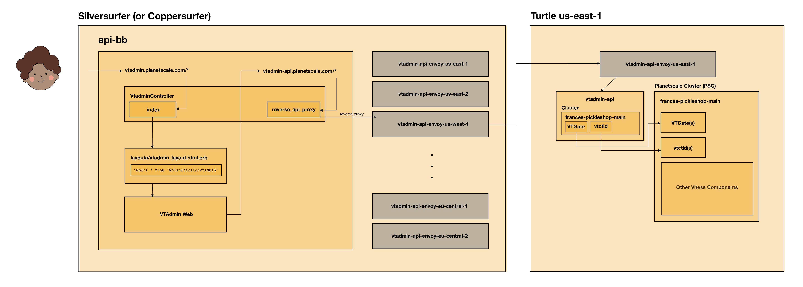

# VTAdmin at Planetscale
VTAdmin a web UI and API that allows users to manage their Vitess clusters. At Planetscale, VTAdmin is deployed as two parts: VTAdmin API and VTAdmin Web.

VTAdmin currently lives at `vtadmin.planetscale.com`, but must be accessed via a button on a branch's page in the admin portal, i.e. `https://admin.planetscale.com/admin/organizations/frances/databases/broccoli-biscuits/branches/main`. This is because nececessary cookies and url parameters must be set from a branch's page before redirecting to vtadmin.
## Background & Context
VTAdmin was initially built to support a static list of clusters provided at initialization time, and also had a "list-all" structure, wherein resources across all clusters would be fetched at once.

While this works for many of our customers, this was non-ideal for Planetscale as we have thousands of Planetscale Clusters (PSCs), whose addresses change dynamically. 

We needed a solution to "filter down" to just one cluster at a time. While we explored different solutions, including dynamic cluster topology, we decided on **dynamic clusters** to help us use VTAdmin at Planetscale.

### Dynamic Clusters
Dynamic clusters are clusters whose configs are passed after VTAdmin is initialized, as opposed at initialization time. Dynamic cluster configurations can be passed in [gRPC metadata](https://github.com/grpc/grpc-go/blob/master/Documentation/grpc-metadata.md) or HTTP header cookies.

At Planetscale, VTAdmin API is [initialized *without*](https://github.com/planetscale/infra-config-kubernetes/blob/main/deploy/vtadmin-api/common/deployment.yaml#L30-L40) any clusters, and expects dynamic clusters to be passed via HTTP cookie. 

Basic configuration for a dynamic cluster often looks like:
```
{
    "id": "dynamic",
    "name": "my-dynamic-cluster",
    "discovery": "dynamic",
    "discovery-dynamic-discovery": "{\"vtctlds\": [ { \"host\": { \"fqdn\": \"localhost:15000\", \"hostname\": \"localhost:15999\" } } ], \"vtgates\": [ { \"host\": {\"hostname\": \"localhost:15991\" } } ] }"
}
```

Specifically, at Planetscale, a dynamic configuration for a PSC looks like:
```
{
    id: <organization.name>-<database.name>-<branch.public_id>,
    name: <organization.name>-<database.name>-<branch.public_id>,
    discovery: "dynamic",
    "discovery-dynamic-discovery": "
        {
            vtctlds: [{ host: { fqdn: "<vtctld.name>.user-data.svc.cluster.local:<vtctld.web_port>", hostname: "<vtctld.name>.user-data.svc.cluster.local:<vtctld.grpc_port>" } }],
            vtgates: [{ host: { hostname: "<vtgate.name>.user-data.svc.cluster.local:<vtgate.grpc_port>" } }]
        }
    "
}
```
where the addresses are the service addresses for a PSC's vtctld and vtgate deployments. 

## Infrastructure & Design
In order to access the PSCs, we deploy one VTAdmin API per turtle (region). VTAdmin Web is deployed with [api-bb](https://github.com/planetscale/api-bb/blob/main/package.json#L16) as an imported [NPM package](https://www.npmjs.com/package/@planetscale/vtadmin) in the Silversurfer cluster. As a consequence of this set up, we use Envoy to proxy requests from VTAdmin Web (in Silversurfer) to a target turtle's VTAdmin API.

The E2E VTAdmin process looks like:
1. A user accesses a branch's (PSC's) VTAdmin through the admin portal (`admin.planetscale.com` --> `vtadmin.planetscale.com`).
2. VTAdmin Controller sets the necessary cookies for VTAdmin web to work in API BB:
    - `cluster`: this is the dynamic cluster configuration cookie (see above)
    - `vtadmin_database_name`, `vtadmin_organization_name`, and `vtadmin_branch_name`: these are used so VTAdmin Controller knows which Planetscale branch the user is looking at
3. All API requests from vtadmin.planetscale.com are routed to `vtadmin-api.planetscale.com#reverse_proxy_api`.
4. VTAdmin Controller `#reverse_proxy_api` looks up the correct vtadmin-api-envoy address for the current branch, and proxies the request to the vtadmin-api-envoy.
5. `vtadmin-api-envoy` forwards requests to its counterpart within the turtle.
6. `vtadmin-api-envoy` (in the turtle) forwards the request to vtadmin-api inside the same turtle.
7. `vtadmin-api` uses the `cluster` cookie to filter down the api's cluster set to just the target PSC.
8. Consequently, all API requests are fulfilled with only the filtered down cluster set.
9. `vtadmin-api`'s response is returned downstream, all the way back to api-bb's VTAdmin Controller.



## Updating VTAdmin
VTAdmin can be updated periodically to the latest version on vitess-private. 

### VTAdmin API
To update VTAdmin API:
1. Search for the image you intend to update VTAdmin with [here](https://console.cloud.google.com/artifacts/docker/planetscale-registry/us/prod/vitess%2Flite).
2. Copy the image's tag.
3. Open a PR and replace [this line](https://github.com/planetscale/infra-config-kubernetes/blob/main/deploy/vtadmin-api/common/deployment.yaml#L23) with the new image's tag.
4. VTAdmin API is autosynced once the PR is merged. You can check progress in Argo [here](https://argocd.silversurfer.planetscale.net/applications?proj=&sync=&health=&namespace=&cluster=&labels=application%253Dvtadmin-api). 

### VTAdmin Web
To update VTAdmin Web:
1. Follow the steps outlined at [`web/vtadmin/planetscale-vtadmin.md`](https://github.com/planetscale/vitess-private/blob/latest/web/vtadmin/planetscale-vtadmin.md) to release a new version of `@planetscale/vtadmin`.
2. Open a PR against `api-bb` to update the version of `@planetscale/vtadmin` [here](https://github.com/planetscale/api-bb/blob/main/package.json#L16).
3. VTAdmin Web is automatically deployed once the PR is merged.

